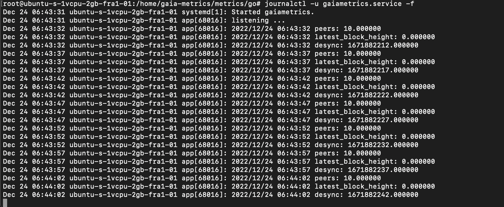
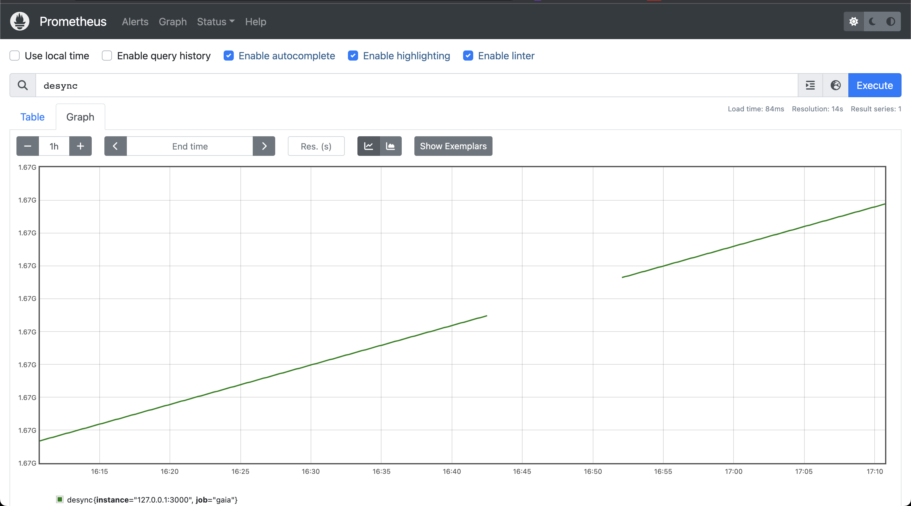

### Description
The repository is the set of tools to collect cosmos node networking performance.
The metrics collection repository contains three key directories: prometheus, gaia, and metrics.

The metrics are being collected each 5s triggered by Prometheus that queries middle layer app written in go and running on `http://127.0.0.1:3000` and underneath operates with a cosmos node running on `http://127.0.0.1:26657`

```Gaia Node(API) <- Go App <- Prometheus```

The application uses only two endpoints: `http://localhost:26657/status`, `http://localhost:26657/net_info` with three properties collected: `n_peers, latest_block_time, latest_block_height` which can be easilly tuned.
Full specification of Cosmos API can be found by the link https://docs.tendermint.com/v0.34/rpc/#/

### Cosmos Installation Manual
Installation of the cosmos network even on a testnet might be tricky, gaia has undergone multiple updates with variety of testnets running. The documentation might also be not always correct having wrong or pointing on outdated properties, or readme files.

I encorage to read the official documentation https://hub.cosmos.network/main/hub-tutorials/join-testnet.html which will require values for properties `trust_height`, `trust_hash`, `rpc_servers`, `seeds` to be assigned, which you may find this repo.

Testnet explorer: https://explorer.theta-testnet.polypore.xyz/ <br />
Testent id: theta-testnet-001

The installation itself.

#### 1. Install and build node with network genesis file downloaded
```
git clone https://github.com/cosmos/testnets/tree/master/public
git checkout v7.0.0

make install
gaiad init CUSTOM_MONIKER --chain-id theta-testnet-001

wget https://github.com/cosmos/testnets/raw/master/public/genesis.json.gz
gunzip genesis.json.gz
cp genesis.json $HOME/.gaia/config/genesis.json

gaiad config chain-id theta-testnet-001
```

#### 2. Set the network parameters as described here, see https://hub.cosmos.network/main/hub-tutorials/join-testnet.html <br />
Or just copy the config files from this repo to Gaia home dir `$HOME/.gaia/config`. 
```
cp gaia/app.toml $HOME/.gaia/config
cp gaia/client.toml $HOME/.gaia/config
cp gaia/config.toml $HOME/.gaia/config
```

#### 3. Launch gaia network
```
gaiad start --x-crisis-skip-assert-invariants
```

### Cosmos Installation Ansible
```
https://github.com/hyphacoop/cosmos-ansible
```

### Metrics Go Installation
Clone this repository, if was not already clonned - `git clone https://github.com/ivanproskuryakov/gaia-metrics` <br />
If required, install golang - https://go.dev/doc/install 

```
cd mertics/go
go build app.go
./app
```



### Metrics Go Daemon
```
nano /etc/systemd/system/gaiametrics.service

sudo systemctl daemon-reload
sudo systemctl start gaiametrics.service
sudo systemctl enable gaiametrics.service
```

See metrics running:
```
journalctl -fu gaiametrics.service
journalctl -u gaiametrics.service -f
```
### Prometheus Installation
```
https://prometheus.io/download/
```

### Prometheus Daemon
```
nano /etc/systemd/system/prometheus.service

sudo systemctl daemon-reload
sudo systemctl start prometheus.service
sudo systemctl enable prometheus.service
```


### Metrics Node Application
The repository contains metrics application wrriten with node.js and TypeScript, see `metrics/node` directory
```
npm run dev
npm run build
http://127.0.0.1:3000/
```